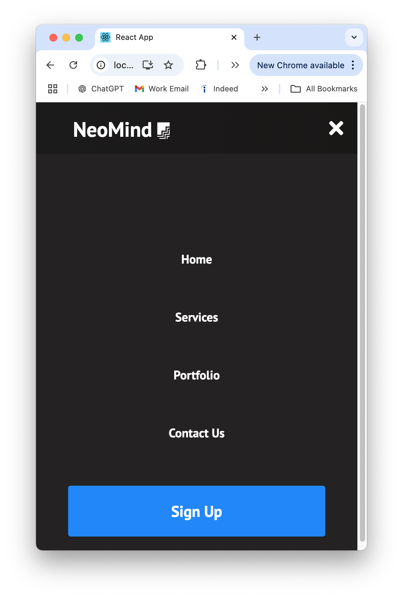

# Navigation Bar UI Design

## Overview

This project implements a responsive navigation bar for a design studio called **Neomind**. The navigation bar is built using **React Hooks** and **React Router**, and it features a mobile-friendly design with a functional hamburger menu. The application allows seamless navigation between pages, ensuring a dynamic and user-friendly experience.

---

## Key Features

- **Dynamic Navigation**  
  The navbar updates the page dynamically upon clicking any menu item, utilizing `React Router` for navigation.  

- **Responsive Design**  
  The navigation bar is fully mobile responsive. On smaller screens, it collapses into a **hamburger menu** that toggles the visibility of the menu items.

- **Modern Styling**  
  The design incorporates custom CSS and **Google Fonts** for a professional look, suitable for a design studio.

---

## Technologies Used

- **React Framework**: To build a modular and reusable navbar component.
- **React Router DOM**: For seamless client-side navigation.
- **React Hooks**: To manage state and handle component logic.
- **CSS**: For custom styling and responsiveness.
- **Google Fonts**: To enhance typography and aesthetics.

---

## Steps Completed

### 1. Setting up the React Framework
- Created a React application as the base for the project.

### 2. Importing `React Router DOM`
- Integrated React Router for enabling dynamic navigation between pages.

### 3. Creating the Navbar Component
- Built a reusable `Navbar` component to house the navigation functionality.

### 4. Importing Google Fonts
- Integrated a modern and professional font using Google Fonts to enhance the UI.

### 5. Styling with CSS
- Designed and implemented the layout for:
  - The main navigation bar.
  - Mobile-responsive hamburger menu.
  - Hover effects and active state indicators.

### 6. Adding Navigation Items
- Used an array of navigation items for flexibility and ease of updates.

### 7. Building a Button for Hamburger Menu
- Created a toggle button to show/hide the navigation menu in mobile view.
- Added specific CSS for the hamburger button and its states.

### 8. Implementing JSX and State Logic
- Mapped through the navigation items array to dynamically render menu links.
- Managed menu visibility using `useState` from React Hooks.

### 9. Creating the Pages
- Built individual React components to serve as pages for each navigation link.

### 10. Final Touches
- Polished the layout, styling, and functionality to ensure smooth user interactions.

---

## Project Structure

src/
├── components/
│   └── Navbar.js   // Main navbar component
├── pages/
│   ├── Home.js     // Home page component
│   ├── About.js    // About page component
│   ├── Services.js // Services page component
│   └── Contact.js  // Contact page component
├── App.js          // Main application file
├── App.css         // Styling for the application
└── index.js        // Entry point for the React app


## How to Run the Project

1. Clone the repository:
   ```bash
   git clone <repository_url>
   cd neomind-navbar
2. Install dependencies:
   ```bash
   git clone <repository_url>
   cd neomind-navbar
3. Start the development server:
   ```bash
   npm start
4. Open the application in your browser at http://localhost:3000.

## Screenshots

### Desktop View

*The navigation bar displayed on a desktop screen.*

### Mobile View

*The navigation bar displayed in mobile view with the hamburger menu open.*

## Key Requirements Addressed

1. **Responsive Navbar**  
   The navbar adapts seamlessly to various screen sizes and includes a functional hamburger menu for smaller devices.

2. **Dynamic Navigation**  
   Each menu item links to a specific page using `React Router`, and the page content updates dynamically without refreshing.

3. **Modern Design**  
   Styling incorporates custom CSS and Google Fonts to align with Neomind's design studio theme.

## Conclusion

This project demonstrates my ability to create a responsive and interactive UI component that meets modern web design standards. The navigation bar serves as an essential element for any design-focused website, ensuring both functionality and aesthetic appeal.

Feel free to reach out with any questions or feedback! 🎉
